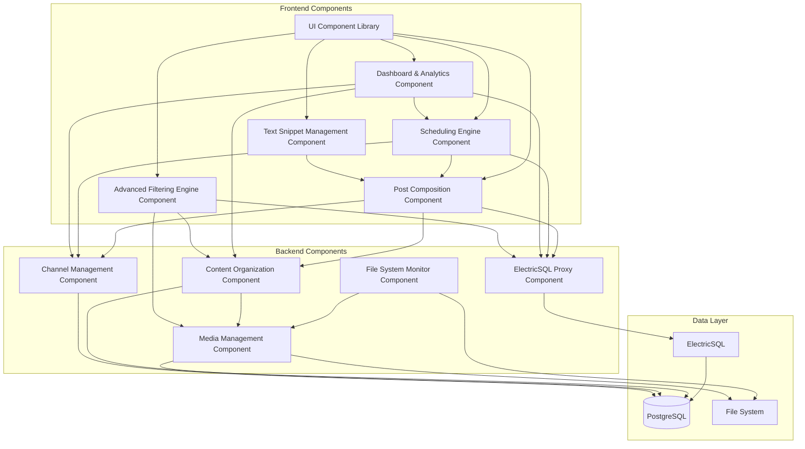

# Components

Based on the architectural patterns, tech stack, and data models, the major logical components span both frontend and backend concerns with clear boundaries and interfaces.

## Media Management Component

**Responsibility:** Handles all media file operations, scanning, metadata extraction, and thumbnail generation

**Key Interfaces:**

- `scanFileSystem(path?: string): Promise<ScanResult>` - Trigger file system scan
- `generateThumbnail(mediaId: string): Promise<string>` - Create thumbnail for media item
- `extractMetadata(filepath: string): Promise<MediaMetadata>` - Extract file metadata
- `calculateContentHash(filepath: string): Promise<string>` - Generate content hash for change detection

**Dependencies:** File system access, PostgreSQL via Prisma, thumbnail generation libraries

**Technology Stack:** Bun server process, sharp/ffmpeg for media processing, chokidar for file watching

## Content Organization Component

**Responsibility:** Manages shoots, tagging system, and content categorization workflows

**Key Interfaces:**

- `createShoot(name: string, date: Date): Promise<Shoot>` - Create new shoot
- `assignMediaToShoot(mediaId: string, shootId: string): Promise<void>` - Associate media with shoot
- `batchAssignMediaToShoot(mediaIds: string[], shootId: string): Promise<BatchResult>` - Batch assign multiple items to shoot
- `createTagDimension(name: string, isExclusive: boolean): Promise<TagDimension>` - Create tag category
- `applyTags(mediaId: string, tagValueIds: string[]): Promise<void>` - Tag media items
- `batchApplyTags(mediaIds: string[], tagValueIds: string[]): Promise<BatchResult>` - Apply tags to multiple items

**Dependencies:** Media Management Component, PostgreSQL via Prisma

**Technology Stack:** Bun server with Elysia.js routes, ElectricSQL for real-time sync

## Post Composition Component

**Responsibility:** Handles post creation, editing, caption management, and hashtag processing

**Key Interfaces:**

- `createPost(data: CreatePostData): Promise<Post>` - Create new post with media items
- `updatePost(postId: string, updates: PostUpdates): Promise<Post>` - Modify existing post
- `parseHashtags(caption: string): string[]` - Extract hashtags from caption text
- `insertTextSnippet(caption: string, snippet: string, position: number): string` - Add reusable text

**Dependencies:** Content Organization Component, Channel Management Component

**Technology Stack:** React components with TanStack Query, Jotai for local state, ElectricSQL sync

## Channel Management Component

**Responsibility:** Manages posting destinations, platform-specific configuration, and scheduling rules

**Key Interfaces:**

- `createChannel(name: string, type: ChannelType): Promise<Channel>` - Create posting destination
- `updateDefaultHashtags(channelId: string, hashtags: string[]): Promise<void>` - Configure defaults
- `createContentSchedule(channelId: string, schedule: ScheduleConfig): Promise<ContentSchedule>` - Set posting schedule
- `getEligibleContent(scheduleId: string): Promise<Media[]>` - Find content matching schedule filters

**Dependencies:** Post Composition Component

**Technology Stack:** Bun server with Prisma, React admin interfaces

## Scheduling Engine Component

**Responsibility:** Handles content scheduling, calendar management, and posting workflow coordination

**Key Interfaces:**

- `getCalendarView(startDate: Date, endDate: Date): Promise<CalendarData>` - Retrieve calendar data
- `calculateContentRunway(channelId: string): Promise<RunwayProjection>` - Calculate available content days
- `detectScheduleConflicts(postId: string, date: Date): Promise<Conflict[]>` - Check for posting conflicts

**Dependencies:** Post Composition Component, Channel Management Component

**Technology Stack:** React calendar components, TanStack Query for data fetching, ElectricSQL for real-time updates

## File System Monitor Component

**Responsibility:** Monitors file system changes and maintains synchronization between disk and database

**Key Interfaces:**

- `startWatching(path: string): void` - Begin monitoring directory
- `handleFileChange(event: FileChangeEvent): Promise<void>` - Process file system events
- `validateFileIntegrity(mediaId: string): Promise<boolean>` - Check file still exists and unchanged
- `syncFileSystemState(): Promise<SyncResult>` - Full reconciliation between disk and DB

**Dependencies:** Media Management Component

**Technology Stack:** Bun server background process, chokidar file watcher, PostgreSQL updates

## ElectricSQL Proxy Component

**Responsibility:** Handles ElectricSQL shape configuration, authentication, and data filtering

**Key Interfaces:**

- `configureShape(table: string, filters?: ShapeFilters): ShapeConfig` - Define data shapes
- `handleShapeRequest(request: ShapeRequest): Promise<ShapeResponse>` - Process shape subscriptions
- `manageShapeSubscriptions(): void` - Handle client shape lifecycle

**Dependencies:** All data-producing components

**Technology Stack:** Bun server with Elysia.js, ElectricSQL client library

## Dashboard & Analytics Component

**Responsibility:** Provides homepage dashboard with content status widgets, runway visualization, and platform analytics

**Key Interfaces:**

- `getDashboardData(): Promise<DashboardData>` - Aggregate dashboard metrics
- `getContentUtilizationStats(): Promise<UtilizationStats>` - Platform-wide content statistics
- `getRunwayProjections(): Promise<RunwayData[]>` - Content runway by channel
- `getRecentActivity(): Promise<ActivityFeed>` - Latest posting activity across channels

**Dependencies:** Scheduling Engine Component, Channel Management Component, Content Organization Component

**Technology Stack:** React with data visualization libraries, TanStack Query for real-time updates, ElectricSQL sync

## Advanced Filtering Engine Component

**Responsibility:** Handles complex multi-dimensional filtering with AND/OR/NOT logic and filter preset management

**Key Interfaces:**

- `buildFilterQuery(criteria: FilterCriteria[]): FilterQuery` - Construct complex filter queries
- `executeFilter(query: FilterQuery): Promise<Media[]>` - Execute filter and return results
- `saveFilterPreset(name: string, query: FilterQuery): Promise<void>` - Save commonly used filters
- `validateScheduleEligibility(mediaId: string, scheduleId: string): boolean` - Check content eligibility

**Dependencies:** Content Organization Component, Media Management Component

**Technology Stack:** Advanced query engine, React filter UI components, PostgreSQL full-text search

## Text Snippet Management Component

**Responsibility:** Manages reusable text snippets for captions, handles snippet library, and provides insertion capabilities

**Key Interfaces:**

- `createSnippet(name: string, content: string, category?: string): Promise<TextSnippet>` - Create new snippet
- `getSnippetsByCategory(category?: string): Promise<TextSnippet[]>` - Retrieve snippets for selection
- `insertSnippetAtCursor(snippetId: string, text: string, position: number): string` - Insert snippet into text
- `searchSnippets(query: string): Promise<TextSnippet[]>` - Find snippets by name or content

**Dependencies:** Post Composition Component

**Technology Stack:** Text processing utilities, React text editor integration, search functionality

## UI Component Library

**Responsibility:** Provides consistent, reusable UI components following design system principles

**Key Interfaces:**

- Presentational components (pure UI with props)
- Container components (data-connected, business logic)
- Compound components (complex UI patterns)
- Form components with validation

**Dependencies:** None (presentational), TanStack Query + ElectricSQL (container components)

**Technology Stack:** React with TypeScript, Tailwind CSS, Daisy UI, Storybook documentation

## Component Diagrams

