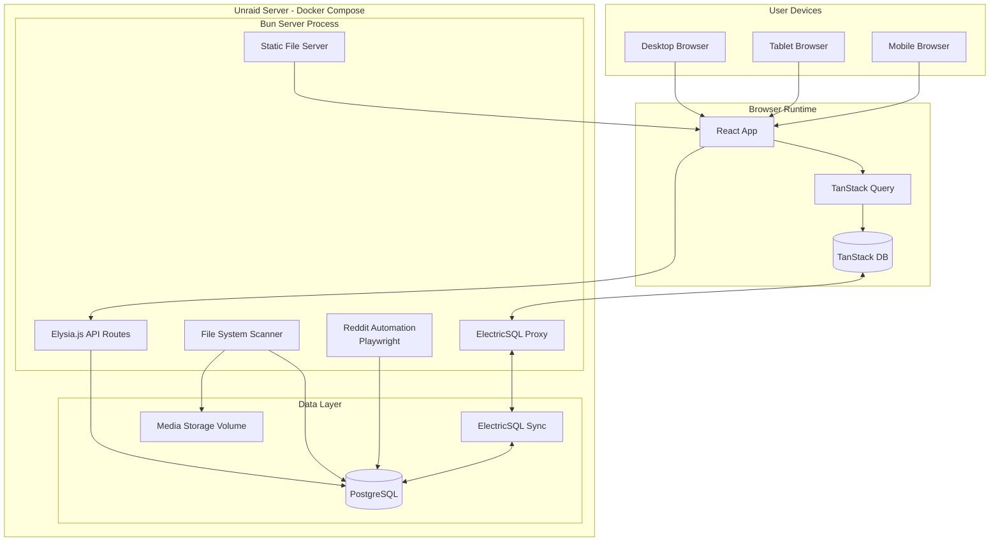

# High Level Architecture

## Technical Summary

FansLib employs a **modern monorepo fullstack architecture** with a React frontend and Bun backend, both built with TypeScript and deployed via Docker Compose on self-hosted Unraid infrastructure. The **PostgreSQL + Prisma** stack provides robust data modeling for complex content relationships and multi-dimensional tagging, while **ElectricSQL + TanStack DB** enables real-time data synchronization and optimistic updates. The **Bun server** integrates multiple concerns: static React app serving, API routes via Elysia.js, ElectricSQL proxy, and file system scanning - all in a single process. Key integration points include **direct file system monitoring** for content discovery, **ElectricSQL real-time sync** for frontend-backend communication, and **TanStack DB** for sophisticated client-side data management. The architecture achieves PRD goals through **shoot-based content organization**, **visual content browsing with advanced filtering**, and **intelligent scheduling workflows** that prevent posting conflicts while maximizing content utilization.

## Platform and Infrastructure Choice

**Decision: Self-Hosted Docker Compose on Unraid**

Based on your self-hosted requirements and adult content privacy needs, FansLib will deploy as a Docker Compose stack on your existing Unraid server infrastructure.

**Platform:** Unraid Docker Host
**Key Services:**

- PostgreSQL (primary database)
- ElectricSQL (real-time sync engine)
- Bun Server (integrated application server)
- React SPA (served through Bun server)

**Deployment Host and Regions:** Local Unraid server with optional VPN access for remote management

**Rationale:** This approach provides complete control over sensitive adult content, eliminates cloud dependencies, leverages existing infrastructure investment, and maintains cost-effectiveness while supporting the specialized workflows required for content management across multiple platforms.

## Repository Structure

**Structure:** Monorepo with Bun workspaces and TurboRepo optimization
**Monorepo Tool:** TurboRepo for build caching and task orchestration
**Package Organization:**

```
@fanslib/
├── apps/
│   ├── web/          # React frontend application with integrated UI and Storybook
│   └── server/       # Bun backend server (Elysia.js)
├── libraries/
│   └── [domain-libs] # Domain-specific libraries (will crystallize during development)
└── configs/
    ├── eslint/       # ESLint configurations
    ├── typescript/  # TypeScript configurations
    └── prettier/    # Prettier configurations
```

Note: The design system lives inside `@fanslib/apps/web/src/components/ui` and is documented via the integrated Storybook in the web app.

## High Level Architecture Diagram



## Architectural Patterns

- **Monorepo Architecture:** Unified codebase with shared dependencies and consistent tooling - _Rationale:_ Enables efficient development of integrated fullstack features while maintaining clear separation between apps and libraries
- **Component-Based UI:** Reusable React components with TypeScript and Storybook documentation, separating presentational (dumb) and container (smart) components - _Rationale:_ Maintainability, testability, and design system consistency across complex content management interfaces
- **Direct Database Access Pattern:** TanStack DB with ElectricSQL sync eliminates traditional API layers - _Rationale:_ Simplified architecture, real-time updates, optimistic UI, and offline capability without complex state management
- **Integrated Server Pattern:** Single Bun process handling static files, API routes, ElectricSQL proxy, and background tasks - _Rationale:_ Simplified deployment, reduced resource usage, and easier development workflow
- **File System Integration Pattern:** Direct file system access with change monitoring integrated into server process - _Rationale:_ Eliminates file upload complexity, maintains direct control over media storage, and enables real-time content discovery
- **Real-Time Sync Pattern:** ElectricSQL + TanStack DB for bidirectional data synchronization - _Rationale:_ Responsive user experience, optimistic updates, conflict resolution, and seamless offline/online transitions
