# Information Architecture (IA)

## Site Map / Screen Inventory

```mermaid
graph TD
    A[Homepage Dashboard] --> B[Content Library]
    A --> C[Integrated Calendar Workspace]
    A --> D[Channels & Platforms]
    A --> E[Settings & Configuration]

    B --> B1[Visual Content Browser]
    B --> B2[Content Detail View]
    B --> B3[Multi-Select Operations]
    B --> B4[Advanced Filtering]
    B --> B5[Shoot Management]

    C --> C1[Calendar Planning View]
    C --> C2[Content Selection Panel]
    C --> C3[Drag-Drop Post Creation]
    C --> C4[Post Detail Screen]
    C --> C5[Content Runway Overlay]
    C --> C6[Bulk Operations Panel]

    C4 --> C4A[Post Composition Interface]
    C4 --> C4B[Media Management]
    C4 --> C4C[Caption & Hashtag Editor]
    C4 --> C4D[Channel & Schedule Settings]
    C4 --> C4E[Post History & Analytics]

    D --> D1[Channel Configuration]
    D --> D2[Reddit Automation Settings]
    D --> D3[Platform Status Overview]

    E --> E1[Tag Dimension Management]
    E --> E2[Default Hashtags & Snippets]
    E --> E3[System Preferences]
```

## Navigation Structure

**Primary Navigation:** Dashboard-centric design with persistent sidebar navigation enabling quick access to all major functional areas without losing context

**Integrated Calendar Workspace Design:**

- **Split-screen layout:** Content library panel (collapsible) + Full calendar view
- **Schedule virtual posts as drop zones:** Drag content directly onto schedule slots to create posts
- **Quick calendar actions:** Basic operations (duplicate, reschedule, quick status check) directly in calendar
- **Post detail access:** Click/double-click calendar posts to open dedicated post detail screen
- **Calendar context preservation:** Return to same calendar position after post detail editing

**Post Detail Screen:**

- **Full-featured editing environment:** Complete post composition interface with all metadata
- **Media management:** Add/remove/reorder media items within the post
- **Advanced caption editing:** Full text editor with hashtag management, snippet insertion
- **Channel-specific settings:** Platform-specific options
- **Post history:** View posting history, analytics, and platform-specific URLs
- **Deletion with safeguards:** Confirmation dialogs and content reassignment options

**Breadcrumb Strategy:** Contextual breadcrumbs showing current location within bulk scheduling sessions, with quick navigation back to calendar view or content library
