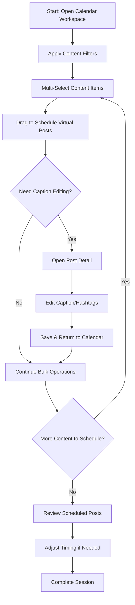
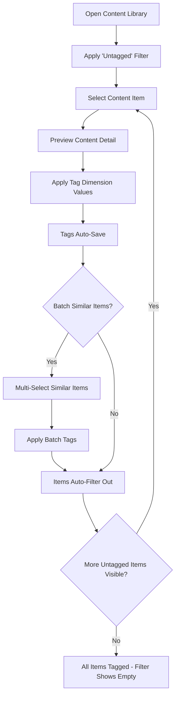
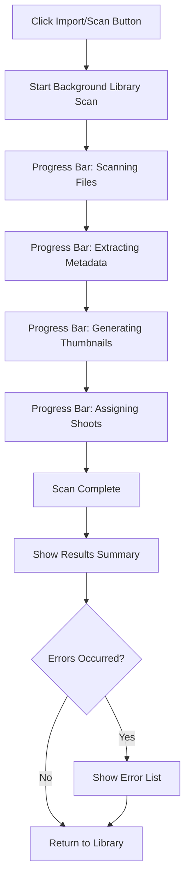

# User Flows

## Critical User Flows

**Flow 1: Bulk Content Scheduling Session**

**User Goal:** Schedule 2 weeks to 1 month of content across multiple platforms in a single session

**Entry Points:** Homepage dashboard → Calendar Workspace, or direct navigation to Calendar Workspace

**Success Criteria:** 20-50 posts created and scheduled across multiple channels with minimal repetitive actions

### Flow Diagram: Bulk Content Scheduling Session

### Edge Cases & Error Handling:

- Content eligibility conflicts: Visual warnings when dragging ineligible content to restricted schedule slots
- Repost prevention: Warnings and confirmations when attempting to schedule content already posted to same platform
- Session interruption: Auto-save draft posts and restore multi-select state when returning to session
- Bulk operation failures: Clear feedback on partial successes with ability to retry failed operations
- Calendar navigation during selection: Preserve multi-select state when changing calendar views

**Flow 2: Content Tagging Workflow**

**User Goal:** Review and tag newly imported content items with appropriate tag dimension values

**Entry Points:** Content Library with untagged filter applied

**Success Criteria:** All desired content items have complete tag dimension assignments, ready for filtering and scheduling workflows

### Flow Diagram: Content Tagging Workflow

### Edge Cases & Error Handling:

- Batch tagging: Handle exclusive tag dimensions when batch-applying to multiple items
- Large content sets: Performance optimization for filtering large libraries
- Filter state persistence: Remember filter settings between sessions

**Flow 3: Content Discovery & Organization**

**User Goal:** Find specific content using multi-dimensional filtering within 20 seconds

**Entry Points:** Content Library, Calendar Workspace content panel

**Success Criteria:** Located target content and ready for next action (scheduling, tagging, etc.)

**Flow 4: Post Detail Management**

**User Goal:** Edit, refine, or delete individual posts with full control over metadata

**Entry Points:** Calendar post click, post search results

**Success Criteria:** Post updated/deleted with changes reflected across all relevant views

**Flow 5: Content Import & Library Scanning**

**User Goal:** Scan the file system for new/changed content and update the library with automatic shoot organization

**Entry Points:** Content Library → Import/Scan button

**Success Criteria:** Library updated with all new content properly organized by folder-based shoots, with summary of changes

### Flow Diagram: Content Import & Library Scanning

### Process Details:

- **Full library scan:** Complete filesystem scan checking for new, modified, and removed files
- **Folder-based shoots:** Automatic shoot assignment based on folder structure
- **Background processing:** Metadata extraction, thumbnail generation, and database updates
- **Progress indication:** Simple percentage progress bar showing overall completion
- **Results summary:** Count of added, updated, renamed, and removed items

### Error Handling:

- **File access errors:** Skip inaccessible files, report in error list
- **Metadata extraction failures:** Use filename/folder info as fallback
- **Duplicate detection:** Handle based on file hash comparison

## Error Handling Patterns

**Error Handling Philosophy:** Simple, focused error messages with clear next actions. No verbose explanations.

### Error Categories & Response Patterns

**1. Validation Errors (User Input)**

_Pattern:_ Immediate inline feedback

_Examples:_

- Invalid file formats during import
- Missing required fields in post creation
- Tag dimension constraint violations
- Schedule conflicts (same content, same platform, same timeframe)

_UI Response:_

- Red border + error icon on affected fields
- Brief error message below field
- Prevent form submission until resolved

**2. Operation Failures (System/Network)**

_Pattern:_ Toast notifications with retry option

_Examples:_

- Failed content uploads
- Network timeouts during operations
- Database connection issues
- Platform API failures

_UI Response:_

- Toast notification with brief error summary
- Retry button for transient failures

**3. Data Conflicts & Integrity Issues**

_Pattern:_ Confirmation dialogs

_Examples:_

- Attempting to delete content with scheduled posts
- Repost prevention warnings
- Shoot reassignment with existing relationships
- Tag dimension changes affecting existing content

_UI Response:_

- Modal dialog with conflict explanation
- Clear options to resolve (reassign, cancel, force)
